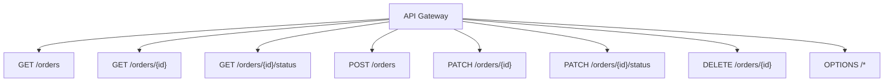

# STEP21 API Gateway連携

このステップでは、Lambda を API Gateway の HTTP 入口につなぐ考え方を整理する。

## 目的

- HTTP リクエストを Lambda に渡す入口を作る
- ルート単位の責務を整理する
- CORS を含めたブラウザアクセスを考える
- Next.js から呼びやすい REST API の形にする

## 役割分担

### API Gateway

- HTTP エンドポイントを公開する
- パスとメソッドで Lambda へ振り分ける
- CORS を返す
- 将来的に認証やスロットリングを載せる

### Lambda

- 実際のビジネスロジックを持つ
- 入力を検証する
- データを返す

### Next.js

- API を呼び出す
- 画面状態を更新する
- 直接 AWS の内部実装には触れない

## このプロジェクトでの想定ルート



## 実装イメージ

`src/lambda/order-api-gateway-handler.ts` は、API Gateway proxy integration で受けたイベントをルーティングする。

- `GET /orders` は注文一覧
- `GET /orders/{id}` は注文詳細
- `GET /orders/{id}/status` はステータス取得
- `POST /orders` は注文登録
- `PATCH /orders/{id}` は注文更新
- `PATCH /orders/{id}/status` はステータス更新
- `DELETE /orders/{id}` は注文削除

## CORS

ブラウザから呼ぶため、少なくとも次のヘッダーを返す。

```http
Access-Control-Allow-Origin: *
Access-Control-Allow-Headers: Content-Type,X-Request-Id
Access-Control-Allow-Methods: DELETE,GET,OPTIONS,PATCH,POST
```

## API Gateway の設計観点

- 1 つの Lambda に集約するか、機能ごとに分けるかを決める
- ルートごとに責務を過剰に分けすぎない
- 404 と 400 の責務をどこで判断するかを明確にする
- 変更しやすいルート構成にする

## よくある確認事項

### 画面からだけ `500` になる

Lambda 単体では成功するのに、画面からの注文登録だけ `500` になる場合は、フロントエンドが古い API Gateway URL を参照していることがある。

確認順:

1. `.env.local` の `NEXT_PUBLIC_API_BASE_URL` を確認する
2. API Gateway の最新 URL に合わせる
3. Next.js 開発サーバーを再起動する
4. ブラウザをハードリロードする
5. Network タブで送信先が最新 URL か確認する

補足:

- `NEXT_PUBLIC_*` は起動時に読み込まれる
- API Gateway の ID が変わると、画面は古い URL に送信し続けることがある
- Lambda 直接実行が成功している場合は、API Gateway との接続先ずれを優先して疑う

## フロントエンドとの接続

- `NEXT_PUBLIC_API_BASE_URL` を API Gateway の URL に設定する
- フロントエンドは `fetch` で REST API を呼ぶ
- 将来的に認証を追加しても、呼び出し側の設計を大きく変えない

## このステップでの到達点

- 「API Gateway は HTTP の入口」
- 「Lambda は処理本体」
- 「フロントエンドは REST API を呼ぶだけ」
