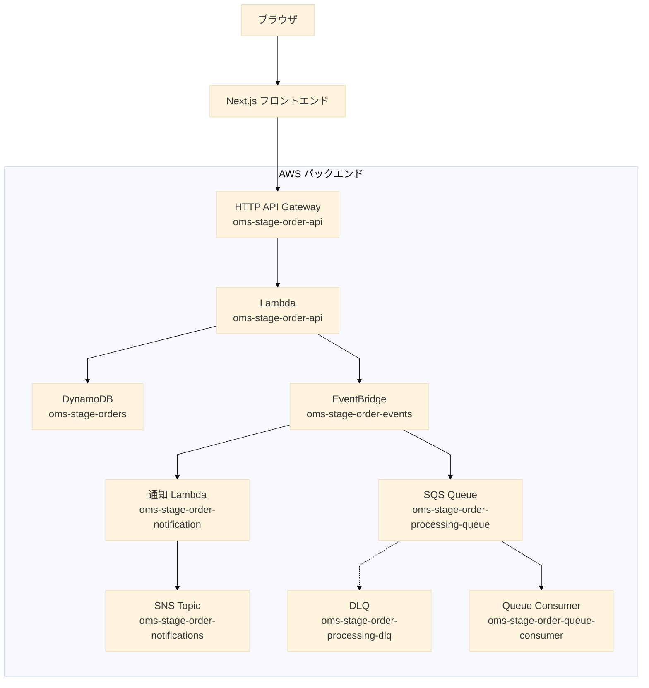

# 注文管理システム 最終構成図

## 要点

- フロントエンドは Next.js、バックエンドは AWS です。
- 同期系は `HTTP API Gateway -> Lambda -> DynamoDB` で処理します。
- 非同期系は `EventBridge -> 通知 Lambda -> SNS` と `EventBridge -> SQS -> Queue Consumer` に分かれます。
- 失敗メッセージは `SQS -> DLQ` に退避します。
