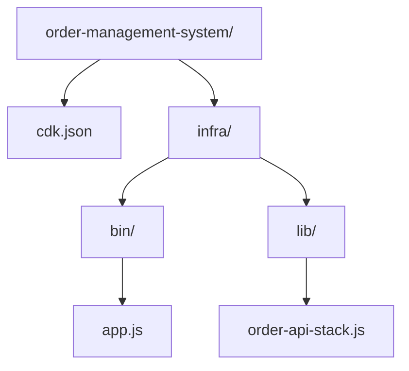

# STEP25 CDKプロジェクト作成

このステップでは、AWS CDK で今後のインフラを作るための最小プロジェクトを整える。

## 目的

- CDK アプリの実行場所を決める
- `synth` できる最小構成を作る
- 後続の STEP26 以降で DynamoDB、Lambda、API Gateway を追加できるようにする

## 作成物



## 依存関係

必要なパッケージ:

```bash
npm install -D aws-cdk-lib constructs
```

`aws-cdk` CLI は `npx aws-cdk` で実行できる。

## CDKアプリ

### `cdk.json`

CDK のエントリポイントを定義する。

```json
{
  "app": "node infra/bin/app.js"
}
```

### `infra/bin/app.js`

アプリ本体を起動し、ステージ名を context から読む。

```js
const cdk = require("aws-cdk-lib");
const { OrderApiStack } = require("../lib/order-api-stack");

const app = new cdk.App();
const stage = app.node.tryGetContext("stage") ?? "dev";

new OrderApiStack(app, `Oms${stage}OrderApiStack`, {
  env: {
    account: process.env.CDK_DEFAULT_ACCOUNT,
    region: process.env.CDK_DEFAULT_REGION ?? "ap-northeast-1",
  },
  stage,
});
```

### `infra/lib/order-api-stack.js`

現段階では、まだ実リソースは持たせず、タグと出力だけを定義する。

```js
const cdk = require("aws-cdk-lib");

class OrderApiStack extends cdk.Stack {
  constructor(scope, id, props = {}) {
    super(scope, id, props);
  }
}
```

## 実行確認

### 構文確認

```bash
node infra/bin/app.js
```

### 合成確認

```bash
npx aws-cdk synth
```

### 差分確認

```bash
npx aws-cdk diff
```

## このステップの到達点

- CDK の実行入口ができている
- `npx aws-cdk synth` が通る
- 次の STEP26 で DynamoDB を足せる

## 次の作業

- STEP26: DynamoDBをCDKで作成
- STEP27: LambdaをCDKで作成
- STEP28: API GatewayをCDKで作成
