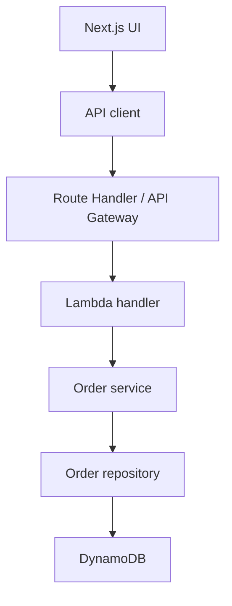
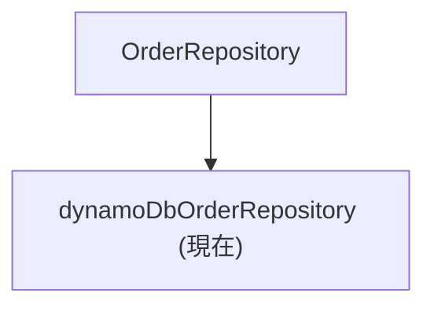

# 注文管理システム API 設計書（抜粋）

本書は、提出用の詳細設計書である [order-management-system-detailed-design.md](./order-management-system-detailed-design.md) から、API に関する要点だけを抜き出した副文書である。  

---

## 1. 文書情報

| 項目 | 内容 |
| --- | --- |
| 文書名 | 注文管理システム API 設計書（抜粋） |
| 文書番号 | `OMS-API-001` |
| 対象システム | Order Management System |
| 対象範囲 | Phase 2, Phase 5, Phase 8, Phase 9 |
| 作成日 | 2026-09-02 |
| 作成者 | Codex |
| レビュー担当 | API 担当 / バックエンド担当 / 運用担当 |
| 承認者 | プロジェクト責任者 |
| 版数 | v1.0 |

### 1.1 改訂履歴

| 版数 | 日付 | 変更内容 | 変更者 |
| --- | --- | --- | --- |
| v1.0 | 2026-09-02 | 主詳細設計書から API 情報を抜粋して整理 | Codex |

### 1.2 参照資料

- [詳細設計書](./order-management-system-detailed-design.md)
- [画面設計書](./order-management-system-screen-design.md)
- [AWS設計書](./order-management-system-aws-design.md)

---

## 2. 位置付け

- 本書は、どの API がどの用途に使われるかを一覧で確認するための副文書とする
- payload、エラー、データ型の詳細は master を参照する

---

## 3. 設計方針

- API は画面から呼びやすい JSON 形式を基本とする
- 認証、入力検証、エラー形式は共通仕様として揃える
- 個別 API の詳細な入力項目やレスポンスは本文で管理する
- データ構造や AWS 連携の詳細は master と AWS 設計書に分担する

---

## 4. 共通仕様

### 4.1 ベースURL

- 開発時: Next.js の同一オリジンまたは `NEXT_PUBLIC_API_BASE_URL`
- AWS 接続時: デプロイ済み API の URL

### 4.2 共通ヘッダー

| ヘッダー | 値 | 備考 |
| --- | --- | --- |
| Content-Type | `application/json` | JSON 入出力時 |
| X-Request-Id | 任意 | 追跡用 |

### 4.3 共通エラー形式

```json
{
  "error": "Message",
  "issues": {}
}
```

- `issues` はバリデーション時のみ返す
- `error` は人が読める文章にする

---

## 5. API 一覧

| API ID | 名称 | Method | Path | 主な用途 |
| --- | --- | --- | --- | --- |
| A-001 | 注文一覧取得 | GET | `/api/orders` | 一覧検索 |
| A-002 | 注文詳細取得 | GET | `/api/orders/[id]` | 1件取得 |
| A-003 | 注文登録 | POST | `/api/orders` | 新規作成 |
| A-004 | 注文更新 | PATCH | `/api/orders/[id]` | 既存更新 |
| A-005 | 注文削除 | DELETE | `/api/orders/[id]` | 削除 |
| A-006 | ステータス更新 | PATCH | `/api/orders/[id]/status` | 状態更新 |
| A-007 | 請求書生成 | GET | `/api/pdf/invoice` | PDF 生成 |
| A-008 | PDF 保存 | GET | `/api/pdf/invoice/store` | S3 保存 |
| A-009 | 署名付き URL | GET | `/api/pdf/invoice/signed-url` | 配布 URL 発行 |
| A-010 | ログイン開始 | GET | `/api/auth/login` | Cognito へ遷移 |
| A-011 | ログイン完了 | GET | `/api/auth/callback` | code 交換 |
| A-012 | ログアウト | GET | `/api/auth/logout` | セッション破棄 |

---

## 6. 個別 API 設計

### 6.1 注文一覧取得

- Endpoint: `/api/orders`
- Method: `GET`
- 認証方式: Cognito セッション
- 呼び出し元: 注文一覧画面

#### Request

| パラメータ | 型 | 必須 | 例 | 説明 |
| --- | --- | --- | --- | --- |
| query | string | 任意 | `Web` | 部分一致検索 |
| status | string | 任意 | `pending` | ステータス絞り込み |
| paymentMethod | string | 任意 | `credit-card` | 支払方法絞り込み |

#### Response

| ステータス | 内容 |
| --- | --- |
| 200 | `orders`, `total` を返す |
| 401 | 未ログイン |
| 403 | 権限不足 |
| 500 | 取得失敗 |

#### レスポンス例

```json
{
  "orders": [],
  "total": 0
}
```

### 6.2 注文詳細取得

- Endpoint: `/api/orders/[id]`
- Method: `GET`
- 認証方式: Cognito セッション
- 呼び出し元: 注文詳細画面

#### Response

| ステータス | 内容 |
| --- | --- |
| 200 | `order` を返す |
| 404 | 注文なし |
| 401 | 未ログイン |
| 403 | 権限不足 |

### 6.3 注文登録

- Endpoint: `/api/orders`
- Method: `POST`
- 認証方式: Cognito セッション
- 権限: `operator` / `admin`

#### Request

| パラメータ | 型 | 必須 | 例 | 説明 |
| --- | --- | --- | --- | --- |
| customerName | string | 必須 | `山田 太郎` | 顧客名 |
| customerEmail | string | 必須 | `taro@example.com` | メール |
| shippingAddress | string | 必須 | `東京都港区...` | 送付先 |
| paymentMethod | string | 必須 | `credit-card` | 支払方法 |
| items | array | 必須 |  | 明細 |

#### Response

| ステータス | 内容 |
| --- | --- |
| 201 | `order` を返す |
| 400 | 入力不正 |
| 401 | 未ログイン |
| 403 | 権限不足 |
| 500 | 保存失敗 |

#### 例

```json
{
  "order": {
    "id": "ORD-20260902-001",
    "status": "pending"
  }
}
```

### 6.4 注文更新

- Endpoint: `/api/orders/[id]`
- Method: `PATCH`
- 認証方式: Cognito セッション
- 権限: `operator` / `admin`

### 6.5 注文削除

- Endpoint: `/api/orders/[id]`
- Method: `DELETE`
- 認証方式: Cognito セッション
- 権限: `admin`

### 6.6 ステータス更新

- Endpoint: `/api/orders/[id]/status`
- Method: `PATCH`
- 認証方式: Cognito セッション
- 権限: `operator` / `admin`

### 6.7 請求書生成

- Endpoint: `/api/pdf/invoice`
- Method: `GET`
- 認証方式: Cognito セッション
- 呼び出し元: PDF プレビュー画面、Step Functions invoice ステップ

#### Response

| ステータス | 内容 |
| --- | --- |
| 200 | PDF バイナリ |
| 404 | 注文がない |
| 500 | 生成失敗 |

### 6.8 PDF 保存

- Endpoint: `/api/pdf/invoice/store`
- Method: `GET`
- 認証方式: Cognito セッション
- 保存先バケット: `PDF_INVOICE_BUCKET_NAME`
- 保存キー: `orders/<orderId>/invoice-<invoiceNumber>.pdf`

### 6.9 署名付き URL

- Endpoint: `/api/pdf/invoice/signed-url`
- Method: `GET`
- 認証方式: Cognito セッション
- 呼び出し元: PDF プレビュー画面

### 6.10 認証 API

- Endpoint: `/api/auth/login`
- Endpoint: `/api/auth/callback`
- Endpoint: `/api/auth/logout`
- 認証開始、code 交換、セッション破棄を担当する

---

## 7. 補足

- 各 API の入力項目、レスポンス、認証条件、エラーコードは本書と master の両方で確認する
- データ型とレスポンス構造は本書の共通仕様と master の関係章で確認する
- 例外ハンドリングとエラーメッセージは AWS 設計書および運用手順と合わせて確認する

---

## 8. バックエンド設計

### 8.1 全体の責務



開発中は Next.js Route Handler と Lambda が同じ Service / Repository を利用する。  
永続化先を DynamoDB に変更するときも、HTTP 層と画面側の変更を最小限にする。

### 8.2 層ごとの責務

| 層 | 責務 | 持たせない責務 |
| --- | --- | --- |
| UI | 入力・表示・画面状態 | DynamoDB の操作 |
| API client | URL、HTTP メソッド、JSON の変換 | 業務ルール |
| Route Handler / API Gateway | HTTP 入力、認証・CORS の入口、HTTP 応答 | 永続化の詳細 |
| Lambda handler | イベント変換とユースケース呼び出し | 画面固有の状態管理 |
| Service | 注文登録・更新・削除の業務操作 | HTTP の詳細 |
| Repository | 注文の読み書き | HTTP ステータス |
| DynamoDB | データの永続化 | 入力値の妥当性判断 |

### 8.3 API 契約

| Method | Path | 成功 | 主なエラー |
| --- | --- | --- | --- |
| GET | `/orders` | `200 { orders, total }` | `400` |
| GET | `/orders/{id}` | `200 { order }` | `404` |
| GET | `/orders/{id}/status` | `200 { status }` | `404` |
| POST | `/orders` | `201 { order }` | `400` |
| PATCH | `/orders/{id}` | `200 { order }` | `400`, `404` |
| PATCH | `/orders/{id}/status` | `200 { order }` | `400`, `404` |
| DELETE | `/orders/{id}` | `200 { deleted, orderId }` | `404` |

エラー応答は次の形にそろえる。

```json
{
  "error": "Order not found",
  "issues": {}
}
```

`issues` は入力検証エラーがある場合だけ返す。クライアントは HTTP ステータスを最初に確認し、成功レスポンスの形を前提に処理する。

### 8.4 データの流れ

#### 登録

1. API 層で JSON を受け取る
2. Zod スキーマで入力を検証する
3. Service が注文 ID、日時、合計金額を決める
4. Repository が注文を保存する
5. API 層が `201` を返す

#### 更新・削除

1. パスから注文 ID を取得する
2. Repository で対象を確認する
3. Service 経由で更新または削除する
4. 対象がなければ `404` を返す

### 8.5 現在の実装と今後の差し替え

現在の Repository は `dynamoDbOrderRepository` である。注文データは DynamoDB に保存され、画面と API は同じ永続データを参照する。



Service が Repository の具象実装を直接公開しないため、将来の保存先変更や検索条件の追加を Repository に閉じ込められる。

### 8.6 設計上の判断

- 入力検証は API の入口で行い、合計金額はサーバー側で再計算する
- HTTP ステータスは API 層が決め、Service は `undefined` や結果で表現する
- 一覧検索は初期段階では Repository のフィルタで実装する
- データ量が増えたら DynamoDB の Query と GSI に置き換える
- Next.js の Route Handler は開発用の BFF として扱い、本番の AWS API と契約を合わせる
