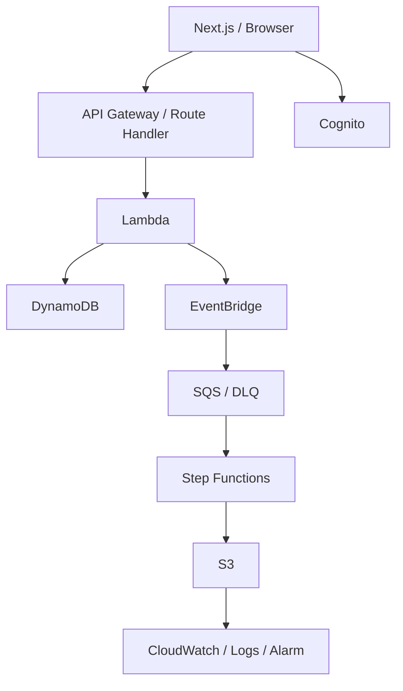
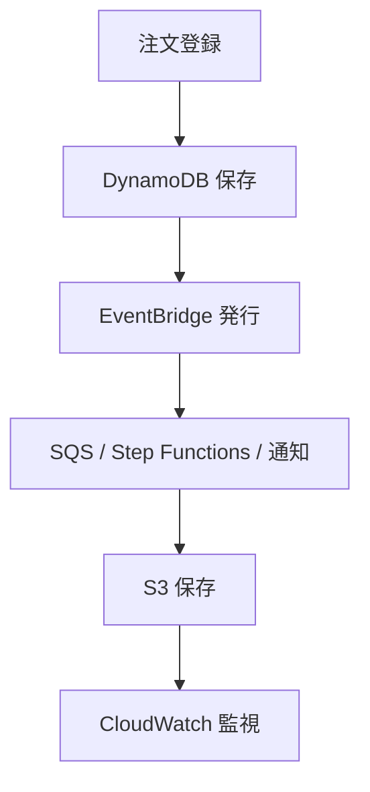

# 注文管理システム AWS 設計書（抜粋）

本書は、提出用の詳細設計書である [order-management-system-detailed-design.md](./order-management-system-detailed-design.md) から、AWS に関する要点だけを抜き出した副文書である。  

---

## 1. 文書情報

| 項目 | 内容 |
| --- | --- |
| 文書名 | 注文管理システム AWS 設計書（抜粋） |
| 文書番号 | `OMS-AWS-001` |
| 対象システム | Order Management System |
| 対象範囲 | Phase 2, Phase 3, Phase 4, Phase 5, Phase 8, Phase 9 |
| 作成日 | 2026-09-02 |
| 作成者 | Codex |
| レビュー担当 | AWS 担当 / 運用担当 / セキュリティ担当 |
| 承認者 | プロジェクト責任者 |
| 版数 | v1.0 |

### 1.1 改訂履歴

| 版数 | 日付 | 変更内容 | 変更者 |
| --- | --- | --- | --- |
| v1.0 | 2026-09-02 | 主詳細設計書から AWS 情報を抜粋して整理 | Codex |

### 1.2 参照資料

- [詳細設計書](./order-management-system-detailed-design.md)
- [画面設計書](./order-management-system-screen-design.md)
- [API設計書](./order-management-system-api-design.md)

---

## 2. 位置付け

- 本書は、主要な AWS サービスと責務を一覧で確認するための副文書とする
- 詳細な命名規則、権限、監視、障害対応は master を参照する

---

## 3. 設計方針

- AWS は責務ごとにサービスを分離して記載する
- 命名規則、権限、監視、障害対応は運用時に追跡しやすい形でまとめる
- 画面/API との責務境界を明確にし、主文書と相互参照できるようにする

---

## 4. AWS 全体構成

### 4.1 AWS 連携の基本フロー

### 4.2 最終構成の要点

- フロントエンドは Next.js、バックエンドは AWS で構成する
- 同期系は `HTTP API Gateway -> Lambda -> DynamoDB` で処理する
- 非同期系は `EventBridge -> 通知 Lambda -> SNS` と `EventBridge -> SQS -> Queue Consumer` に分かれる
- 失敗メッセージは `SQS -> DLQ` に退避する

---

## 5. 利用サービス

| サービス | 主な用途 |
| --- | --- |
| DynamoDB | 注文データの永続化 |
| API Gateway | HTTP 入口 |
| Lambda | CRUD / ワークフロー / 通知 / PDF 処理 |
| EventBridge | イベント配信 |
| SQS / DLQ | 再試行と隔離 |
| Step Functions | 順序付き業務フロー |
| S3 | PDF 保管 |
| CloudWatch | 監視と障害検知 |
| Cognito | 認証 |
| IAM | 最小権限管理 |

---

## 6. 主要リソース

| 種別 | 例 |
| --- | --- |
| 注文テーブル | `oms-${stage}-orders` |
| SQS キュー | `oms-${stage}-order-processing-queue` |
| DLQ | `oms-${stage}-order-processing-dlq` |
| Step Functions | `oms-${stage}-order-processing-workflow` |
| PDF バケット | `PDF_INVOICE_BUCKET_NAME` |
| アラーム | `oms-${stage}-order-processing-workflow-failed-alarm` |

---

## 7. 命名規則

| 種別 | 命名例 | ルール |
| --- | --- | --- |
| 注文テーブル | `oms-dev-orders` | `oms-{stage}-{resource}` |
| Step Functions | `oms-dev-order-processing-workflow` | stage を含める |
| DLQ | `oms-dev-order-processing-dlq` | queue 名に対応させる |
| アラーム | `oms-dev-order-processing-workflow-failed-alarm` | 監視対象が分かる |

---

## 8. CDK / IaC 設計

- スタック: `Oms${stage}OrderApiStack`
- エントリ: `infra/bin/app.js`
- 本体: `infra/lib/order-api-stack.js`
- 環境差分: `stage` を context で切り替える
- 出力値: テーブル名、API URL、Lambda ARN、state machine ARN

---

## 9. 権限設計

### 9.1 Lambda

- DynamoDB: read/write
- EventBridge: put events
- S3: put/get
- Step Functions: invoke task functions
- Logs: write

### 9.2 CI/CD

- `file-publishing-role`
- `deploy-role`
- bootstrap 用の必要最小権限

### 9.3 運用者

- SSO / IAM ロールを分離する
- 開発・運用・レビューの権限を分ける

---

## 10. 監視設計

### 10.1 アラーム一覧

- `oms-${stage}-order-processing-dlq-alarm`
- `oms-${stage}-order-processing-backlog-alarm`
- `oms-${stage}-order-processing-workflow-failed-alarm`
- `oms-${stage}-order-api-5xx-alarm`
- `oms-${stage}-order-api-error-alarm`
- `oms-${stage}-order-notification-error-alarm`
- `oms-${stage}-order-queue-consumer-error-alarm`
- `oms-${stage}-order-workflow-task-error-alarm`
- `oms-${stage}-order-invoice-generation-error-alarm`

### 10.2 監視方針

- 障害検知
- 実行追跡
- 復旧確認

---

## 11. 障害対応設計

- アラーム名から対象サービスを特定する
- CloudWatch Logs で `requestId` / `eventId` / `orderId` を追う
- Step Functions / SQS / DLQ を確認する
- 原因入力を止める
- 正常メッセージまたは再実行で復旧する

---

## 12. セキュリティ設計

- 認証方式: Cognito Hosted UI + セッション
- 認可: `admin` / `operator` / `viewer`
- 変更系 API: 同一オリジン確認と JSON 入力検証を必須
- 帳票配布: signed URL を使い、恒久公開しない
- IAM: `grant*` を最小化
- 機密値: SSM / Secrets Manager の使い分けを行う

---

## 13. 運用・保守

### 13.1 日常確認

- CloudWatch アラームの状態
- Step Functions 実行履歴
- SQS / DLQ の件数
- Lambda ログの error / requestId

### 13.2 障害時

1. アラーム名から対象サービスを特定する
2. CloudWatch Logs で `requestId` / `eventId` / `orderId` を追う
3. Step Functions / SQS / DLQ を確認する
4. 原因入力を止める
5. 正常メッセージまたは再実行で復旧する

### 13.3 保守観点

- API / UI / AWS の責務を分離する
- PDF 生成はテンプレートとデータ整形を分ける
- イベント payload は version 付きで拡張する
