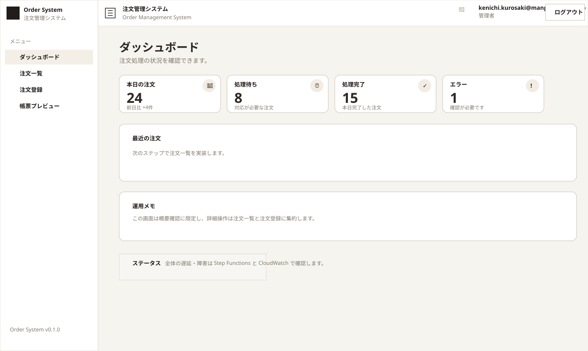
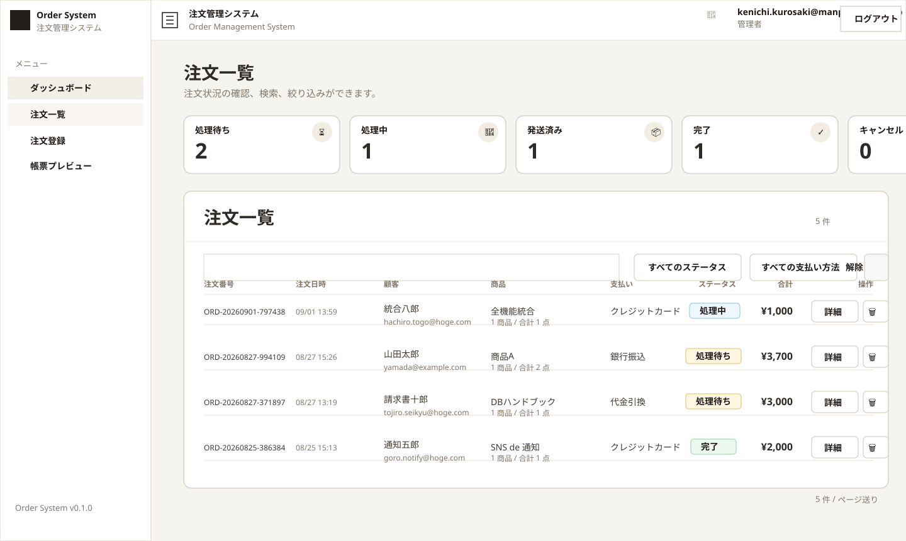
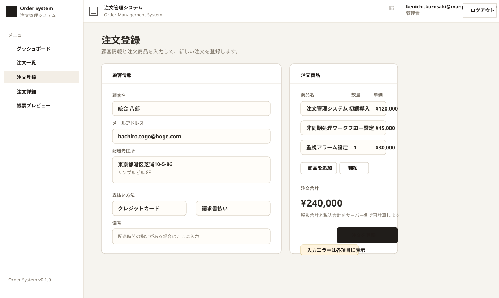
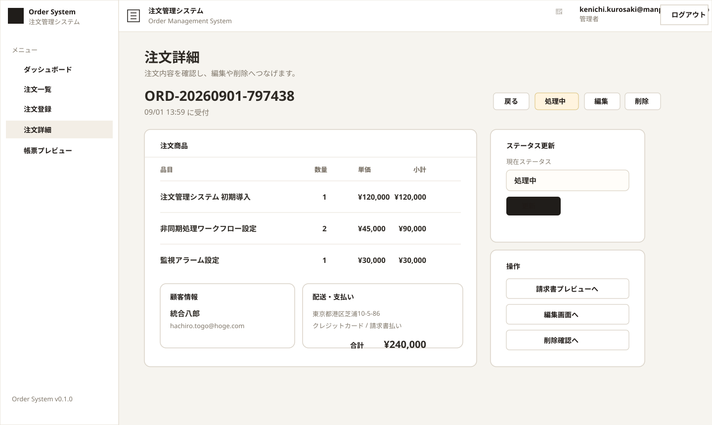
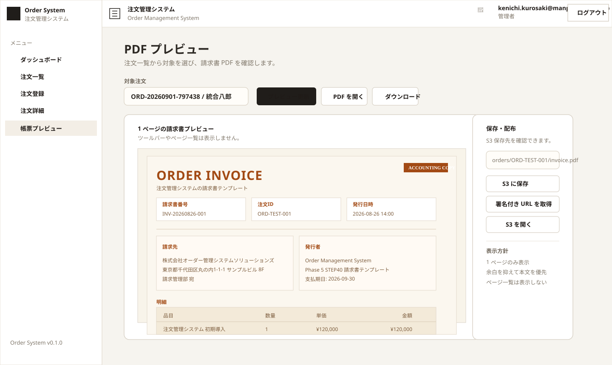
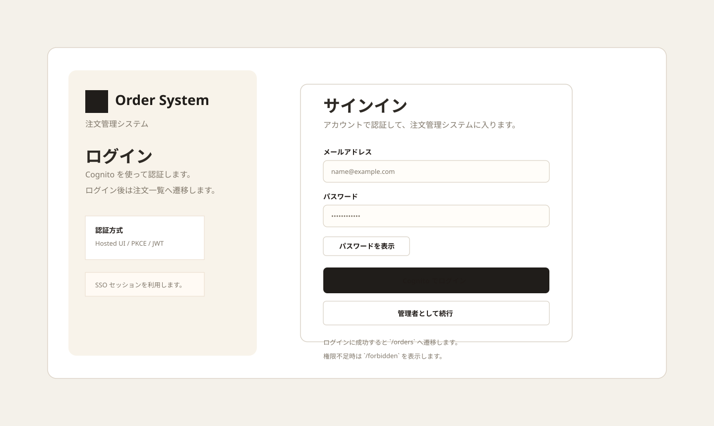
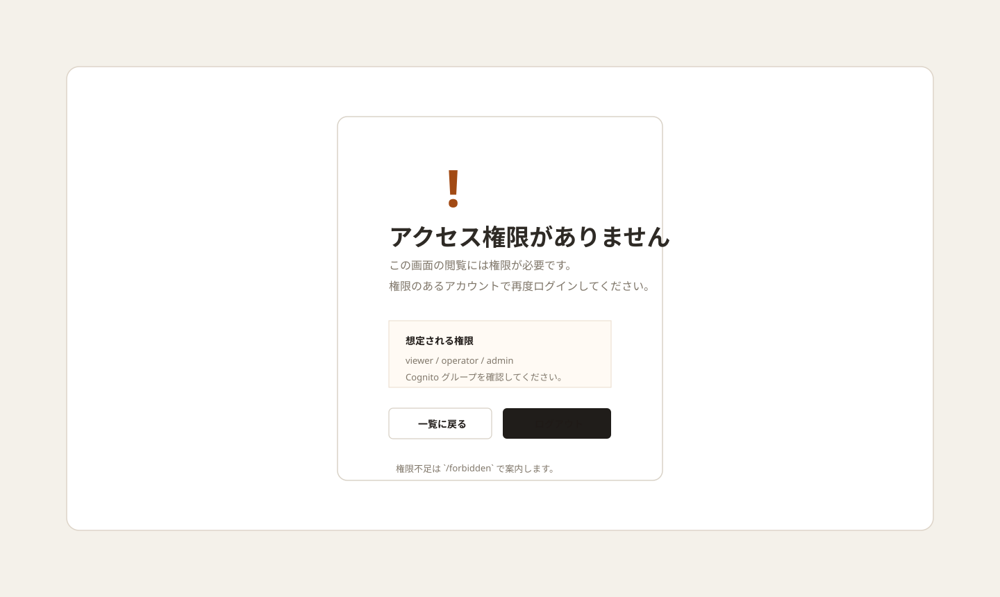

# 注文管理システム 画面設計書（抜粋）

本書は、提出用の詳細設計書である [order-management-system-detailed-design.md](./order-management-system-detailed-design.md) から、画面に関する要点だけを抜き出した副文書である。

---

## 1. 文書情報

| 項目 | 内容 |
| --- | --- |
| 文書名 | 注文管理システム 画面設計書（抜粋） |
| 文書番号 | `OMS-SD-002` |
| 対象システム | Order Management System |
| 対象範囲 | Phase 1, Phase 5, Phase 8, Phase 9 |
| 作成日 | 2026-09-02 |
| 作成者 | Codex |
| レビュー担当 | 開発担当 / UI 担当 / 運用担当 |
| 承認者 | プロジェクト責任者 |
| 版数 | v1.0 |

### 1.1 改訂履歴

| 版数 | 日付 | 変更内容 | 変更者 |
| --- | --- | --- | --- |
| v1.0 | 2026-09-02 | 主詳細設計書から画面情報を抜粋して整理 | Codex |

### 1.2 参照資料

- [詳細設計書](./order-management-system-detailed-design.md)
- [ダッシュボード画面モック SVG](./images/order-management-system-screen-mock-dashboard.svg)
- [注文一覧画面モック SVG](./images/order-management-system-screen-mock-order-list.svg)
- [注文登録画面モック SVG](./images/order-management-system-screen-mock-order-registration.svg)
- [注文詳細画面モック SVG](./images/order-management-system-screen-mock-order-detail.svg)
- [PDF プレビュー画面モック SVG](./images/order-management-system-screen-mock-pdf-preview.svg)
- [ログイン画面モック SVG](./images/order-management-system-screen-mock-login.svg)
- [権限なし画面モック SVG](./images/order-management-system-screen-mock-forbidden.svg)

---

## 2. 位置付け

- 画面の最終仕様は master の詳細設計書を正とする
- 本書は、画面モックと遷移の入口を素早く確認するための副文書とする
- 実装・テスト・運用の判断が必要な場合は master を参照する

## 3. 画面一覧

| 画面ID | 画面名 | URL | 主な用途 |
| --- | --- | --- | --- |
| S-000 | ダッシュボード | `/` | 状況概要の確認 |
| S-001 | 注文一覧 | `/orders` | 検索・一覧確認 |
| S-002 | 注文登録 | `/orders/new` | 新規注文登録 |
| S-003 | 注文詳細 | `/orders/[id]` | 1件詳細確認 |
| S-004 | PDF プレビュー | `/pdf-preview` | 帳票確認 |
| S-005 | ログイン | `/login` | 認証開始 |
| S-006 | 権限なし | `/forbidden` | アクセス不可表示 |

## 4. 画面の役割

| 画面 | 主な要素 | 代表的な操作 |
| --- | --- | --- |
| ダッシュボード | サマリーカード、最近の注文 | 一覧・登録・PDF プレビューへ遷移 |
| 注文一覧 | 検索、絞り込み、一覧テーブル | 詳細遷移、新規登録 |
| 注文登録 | 入力フォーム、保存ボタン | 登録、入力エラー表示 |
| 注文詳細 | 注文情報、明細、操作ボタン | 編集、削除、戻る、PDF プレビュー |
| PDF プレビュー | 更新、ダウンロード、描画領域 | 表示更新、保存、ダウンロード |
| ログイン | ログイン導線 | Cognito へ遷移 |
| 権限なし | 説明文、戻る導線 | 画面遷移のみ |

## 5. 画面モック

### 5.1 ダッシュボード

### 5.2 注文一覧

### 5.3 注文登録

### 5.4 注文詳細

### 5.5 PDF プレビュー

### 5.6 ログイン

### 5.7 権限なし

## 6. 補足

- 画面遷移、入力検証、エラー表示、ローディング状態は master の「6. 画面設計の入口」「13. テスト観点」と対応づける
- レイアウトの詳細な説明は各 SVG と master の記述を突き合わせて確認する
- 画面仕様の詳細が必要な場合は master の `## 6. 画面設計の入口` と相互参照する
