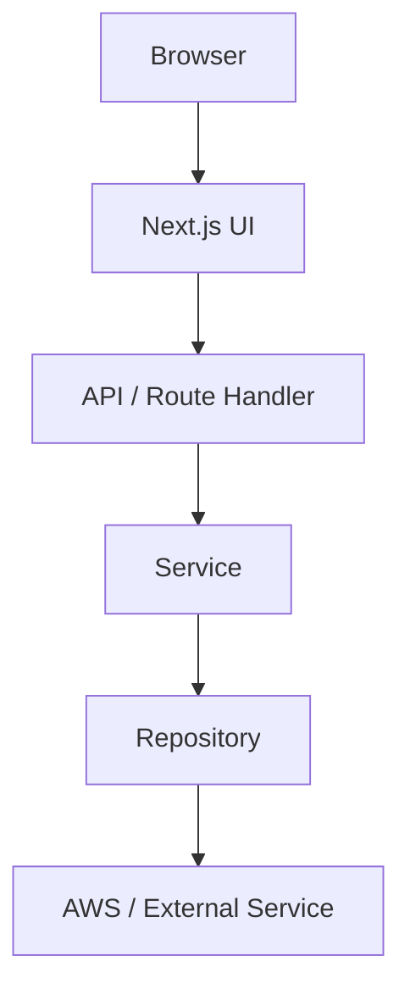

# 詳細設計書テンプレート

このテンプレートは、注文管理システムの詳細設計書を作成するときの共通骨格を示す。  
画面、API、AWS、運用、テストの責務を分けて記述し、実装者がそのまま開発に入れる粒度を目指す。

---

## 1. 文書情報

| 項目 | 内容 |
| --- | --- |
| 文書名 | 詳細設計書 |
| 文書番号 | `DD-XXXX-001` |
| 対象システム | `Order Management System` |
| 対象範囲 | `Phase x` / `STEPxx` |
| 作成日 | `YYYY-MM-DD` |
| 作成者 | `作成者名` |
| レビュー担当 | `レビュー担当名` |
| 承認者 | `承認者名` |
| 版数 | `v0.1` |

### 1.1 改訂履歴

| 版数 | 日付 | 変更内容 | 変更者 |
| --- | --- | --- | --- |
| v0.1 | `YYYY-MM-DD` | 初版作成 | `作成者名` |

### 1.2 参照資料

- `要件定義書`
- `基本設計書`
- `関連する設計書`
- `学習コンテキスト`

---

## 2. 目的・適用範囲

### 2.1 目的

- この詳細設計書で何を実現するかを明確にする
- 実装者が迷わず開発できる粒度まで落とし込む
- テスト、運用、障害対応の観点を同じ文書で追えるようにする

### 2.2 適用範囲

- 対象画面:
- 対象 API:
- 対象バッチ / 非同期処理:
- 対象 AWS リソース:
- 対象運用手順:

### 2.3 前提条件

- 関連する基本設計が承認済みである
- 利用する AWS サービス / 外部サービスが確定している
- 認証・認可の前提が決まっている

---

## 3. システム概要

### 3.1 背景

- 業務上の課題:
- 解決したい内容:
- この機能が属する業務フロー:

### 3.2 設計の考え方

- 画面仕様は UI と導線に集中させる
- API 設計は入力・出力・認証・エラーに集中させる
- AWS 設計はリソース、権限、監視、障害対応に集中させる
- 本書は全体方針と各設計書の関係を整理する

### 3.3 全体の関係

- 画面の詳細:
- API の詳細:
- AWS の詳細:

---

## 4. 責務分担

| 文書 | 主な責務 |
| --- | --- |
| 詳細設計書 | 全体方針、各設計書の役割、横断参照 |
| 画面設計書 | 画面レイアウト、操作、遷移、モック |
| API設計書 | API 契約、データ形式、認証、エラー |
| AWS設計書 | AWS 構成、命名、権限、監視、障害対応 |

---

## 5. 機能の見取り図

| ID | 機能名 | 主な参照先 |
| --- | --- | --- |
| F-001 |  |  |
| F-002 |  |  |
| F-003 |  |  |
| F-004 |  |  |

---

## 6. 画面設計

### 6.1 画面一覧

| 画面ID | 画面名 | URL | 主な用途 |
| --- | --- | --- | --- |
| S-001 |  |  |  |

### 6.2 画面別詳細

- 目的:
- 主な要素:
- 表示項目:
- 操作項目:
- 初期表示:
- 遷移元 / 遷移先:

---

## 7. API設計

### 7.1 API 一覧

| API ID | 名称 | Method | Path | 認証 | 主な用途 |
| --- | --- | --- | --- | --- | --- |
| A-001 |  | GET | `/api/...` | 必要 / 不要 |  |

### 7.2 個別 API 設計

- Endpoint:
- Method:
- 認証方式:
- 呼び出し元:
- Request:
- Response:
- エラー:

---

## 8. AWS設計

### 8.1 AWS 全体構成

### 8.2 利用サービス

- DynamoDB
- API Gateway
- Lambda
- EventBridge
- SQS / DLQ
- Step Functions
- S3
- CloudWatch
- Cognito
- IAM

### 8.3 主要リソース

- 注文テーブル:
- キュー:
- DLQ:
- Step Functions:
- バケット:
- アラーム:

### 8.4 命名規則

- 形式:
- 例:

### 8.5 権限設計

- Lambda:
- CI/CD:
- 運用者:

### 8.6 監視設計

- アラーム一覧:
- 監視方針:

### 8.7 障害対応設計

- 障害検知:
- 切り分け:
- 復旧:

### 8.8 セキュリティ設計

- 認証:
- 認可:
- 機密値:

---

## 9. データ・イベント・運用

### 9.1 データ設計

- Order:
- Invoice:
- 保存先:

### 9.2 イベント設計

- EventBridge:
- detail-type:
- Step Functions:

### 9.3 運用・保守

- 日常確認:
- 障害時:
- 保守観点:

---

## 10. テスト観点

### 10.1 種別

| 種別 | 観点 | 代表ファイル |
| --- | --- | --- |
| 単体 |  |  |
| コンポーネント |  |  |
| 統合 |  |  |
| E2E |  |  |

### 10.2 受け入れ条件

- 主要な業務フローが通る
- 異常系が想定どおりに扱われる
- 監視・障害確認ができる

---

## 11. 未決事項

| ID | 内容 | 影響 | 対応方針 | 状態 |
| --- | --- | --- | --- | --- |
| Q-001 |  |  |  |  |

---

## 12. 付録

### 12.1 主要ファイル

- `src/app/...`
- `src/features/...`
- `src/lambda/...`
- `infra/lib/...`

### 12.2 継続確認

- 必要に応じて関連する設計書を参照する
